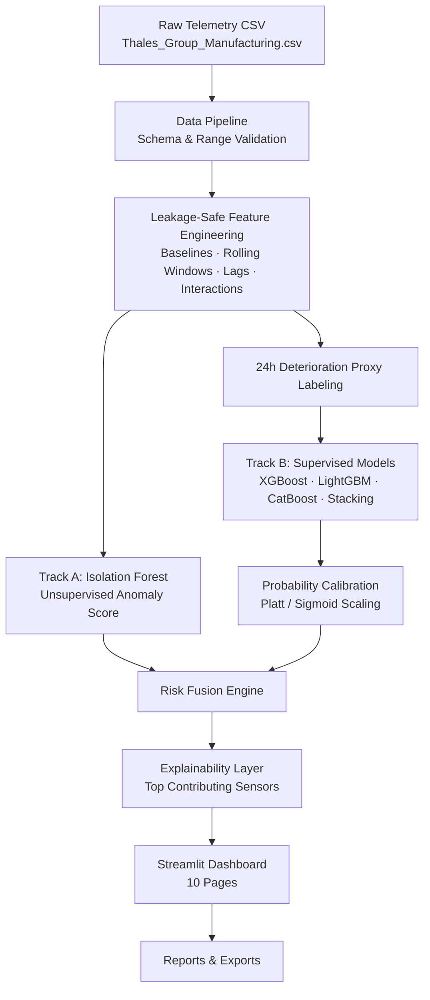
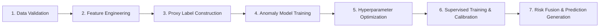

<div align="center">

# 🛡️ FactoryGuard 6G
### Predictive Maintenance & Anomaly Detection for 6G-Integrated Smart Manufacturing

*Turning raw sensor telemetry and 6G network signals into prioritized maintenance decisions.*

[](https://www.python.org/)
[](https://streamlit.io/)
[](#license)
[](model_card.md)
[](#-machine-learning-pipeline)
[](#-important-modeling-disclaimers)

[Overview](#-project-overview) •
[Architecture](#-architecture) •
[Dashboard](#-dashboard-preview) •
[Installation](#-installation--setup) •
[Pipeline](#-machine-learning-pipeline) •
[Performance](#-performance) •
[Documentation](#-documentation)

</div>

---

## 📖 Project Overview

**FactoryGuard 6G** is a condition-monitoring and predictive-maintenance decision-support platform built for **6G-integrated smart manufacturing floors**. It fuses physical machine telemetry (temperature, vibration, power draw, error rates) with 6G network health indicators (latency, packet loss) to distinguish genuine mechanical anomalies from network-induced signal noise — a problem that grows more important as factories become increasingly dependent on low-latency wireless control loops.

The system was built end-to-end — from raw CSV ingestion to a 10-page interactive Streamlit dashboard — on top of **100,000 telemetry records** spanning **50 machines** over a 10-week production window.

| Why it matters | |
|---|---|
| 🏭 **Business value** | Prioritizes maintenance dispatch so engineers act on the highest-risk machines first, instead of reactive, run-to-failure servicing. |
| 🔬 **Technical value** | Demonstrates leakage-safe feature engineering, chronological validation, probability calibration, and a rule-based multi-model fusion engine. |
| 📚 **Research value** | Explores how 6G network reliability metrics can be incorporated into industrial anomaly detection to reduce false alarms caused by communication glitches rather than physical faults. |

> No confirmed breakdown logs exist in the source dataset — see [Important Modeling Disclaimers](#-important-modeling-disclaimers) for exactly what this system does and does not claim.

---

## ✨ Key Features

| | Feature | Description |
|---|---|---|
| 🧠 | **Dual-Track Risk Engine** | Combines unsupervised anomaly detection with supervised deterioration forecasting |
| 🌲 | **Isolation Forest Anomaly Scoring** | Learns per-machine, per-mode normal behavior and flags statistical outliers on a 0–100 scale |
| 🎯 | **Calibrated XGBoost Classifier** | Predicts 24-hour-ahead operational deterioration risk, calibrated via Platt scaling |
| 🧮 | **Risk Fusion Engine** | Merges both tracks with persistence & trend signals into a single, explainable Fused Risk Score |
| 📡 | **6G Network-Aware Modeling** | Treats latency & packet loss as first-class signals to separate network glitches from real faults |
| 🧩 | **Leakage-Safe Feature Pipeline** | Rolling windows, lags, robust z-score baselines — all computed strictly chronologically |
| 📊 | **10-Page Streamlit Dashboard** | Fleet overview, per-machine diagnostics, alerting, temporal trends, and report export |
| 🔍 | **Statistical Explainability** | Surfaces the top contributing sensors per alert in operator-friendly language |
| 🛡️ | **Schema & Range Validation** | Pandera-backed data-quality checks before any modeling occurs |
| 🖨️ | **Report Export** | Generates fleet-level and per-machine exportable reports directly from the dashboard |

---

## 🖥️ Dashboard Preview

The Streamlit application ships with **10 dedicated pages**, each targeting a different operational persona (executive, maintenance engineer, data scientist).

| Page | Purpose |
|---|---|
| `Home.py` | Fleet-wide KPI landing page (monitored units, active alerts, average health) |
| `01_Executive_Overview.py` | High-level fleet health summary for leadership |
| `02_Fleet_Risk_Monitor.py` | Sortable/filterable table of every monitored machine and its risk level |
| `03_Machine_Diagnostic.py` | Deep-dive per-machine sensor trends and generated alert narratives |
| `04_Alert_Center.py` | Consolidated view of active Medium/High risk alerts |
| `05_Temporal_Escalation.py` | Risk trend and escalation trajectory over time |
| `06_Maintenance_Impact.py` | Analysis of maintenance windows vs. operational deterioration |
| `07_Network_Reliability.py` | Scatter analysis of 6G latency/packet loss vs. sensor anomalies |
| `08_Data_Model_Quality.py` | Data-quality and model-quality assurance reporting |
| `09_Methodology_Limitations.py` | In-app documentation of modeling methodology and responsible-use guardrails |
| `10_Report_Export.py` | Export fleet/machine-level reports and data extracts |

> 📸 *Add screenshots of each page to a `docs/screenshots/` folder and reference them here, e.g.* ``

---

## 🏗️ Architecture



### Dual-Track Design

**Track A — Unsupervised Anomaly Engine (Isolation Forest)**
- Learns normal machine baseline behavior from the training split.
- Excludes leakage columns (`Efficiency_Status`, `Predictive_Maintenance_Score`).
- Normalizes scores to a `0–100` percentile ranking, where `0` is standard and `100` is most abnormal.

**Track B — Supervised Proxy Engine (Calibrated XGBoost)**
- Predicts future operational deterioration within a **24-hour lookahead window**.
- Deterioration is defined as a sustained low-efficiency state combined with high temperature (>75°C), high vibration (>3.0 Hz), or high error rates (>9%).
- Calibrated via Platt sigmoid scaling to return well-calibrated probabilities.

**Risk Fusion Engine**
- Combines both tracks — 40% anomaly score, 40% calibrated deterioration probability, 20% recent deviation trend — into a single `fused_risk_score` (0–100).
- Maps scores to `Low` / `Medium` / `High` risk levels and tracks risk persistence and trend slope over time.

---

## 📂 Folder Structure

```
FactoryGuard-6G-Risk-Engine/
├── app/                            # Streamlit multi-page dashboard
│   ├── Home.py                     # Landing entry point (fleet KPIs)
│   ├── pages/                      # 10 dashboard subpages
│   └── components/                 # Shared CSS styling & sidebar filters
├── config/                         # YAML configuration
│   ├── base.yaml                   # Paths, split date, random seed, logging
│   ├── features.yaml               # Rolling windows, lags, sensor columns, leakage guards
│   └── models.yaml                 # Model hyperparameters & risk thresholds
├── data/
│   ├── raw/                        # Thales_Group_Manufacturing.csv (100k records)
│   └── processed/                  # Feature/label/prediction parquet outputs
├── scripts/                        # Pipeline automation entry points
│   ├── run_data_pipeline.py        # Ingest & validate raw telemetry
│   ├── run_eda.py                  # Exploratory data analysis
│   ├── build_features.py           # Leakage-safe feature engineering
│   ├── build_proxy_labels.py       # 24h deterioration proxy label construction
│   ├── train_anomaly_models.py     # Isolation Forest training
│   ├── optimize_hyperparameters.py # Optuna hyperparameter search
│   ├── train_supervised_models.py  # Supervised models + stacking ensemble
│   └── generate_predictions.py     # Risk fusion & final predictions
├── src/factoryguard/                # Core installable package
│   ├── data/                       # Loader & schema/range validator
│   ├── features/                   # Feature pipeline & leakage checks
│   ├── labels/                     # Horizon-based proxy labeler
│   ├── models/                     # Isolation Forest, calibration, stacking
│   ├── scoring/                    # Risk fusion engine
│   ├── explainability/             # Alert narrative / recommendation engine
│   ├── config_loader.py            # YAML config loader
│   ├── paths.py                    # Central path resolution
│   └── logging_config.py           # Logging configuration
├── reports/
│   ├── tables/                     # EDA & model leaderboard CSV/JSON outputs
│   ├── executive_summary/          # Markdown executive summary
│   └── research_paper/             # Full research paper (methodology write-up)
├── tests/                          # Pytest unit & integration tests
├── model_card.md                   # Model card (intended use, metrics, caveats)
├── deployment_guide.md             # Streamlit Community Cloud deployment guide
├── run_all.ps1                     # End-to-end pipeline runner (PowerShell)
├── requirements.txt                # Runtime dependencies
├── requirements-dev.txt            # Dev/test/lint dependencies
└── pyproject.toml                  # pytest / black / ruff configuration
```

---

## 🧰 Technology Stack

| Category | Tools |
|---|---|
| **Language** | Python 3.12 |
| **Data Processing** | Pandas, NumPy, PyArrow, SciPy |
| **Data Validation** | Pandera |
| **Modeling** | Scikit-learn, XGBoost, LightGBM, CatBoost |
| **Hyperparameter Tuning** | Optuna |
| **Explainability** | SHAP |
| **Dashboard** | Streamlit, Plotly |
| **Config** | PyYAML |
| **Reporting** | Jinja2 |
| **Serialization** | Joblib |
| **Testing** | Pytest, pytest-cov |
| **Code Quality** | Ruff, Black, Mypy |

---

## ⚙️ Machine Learning Pipeline

The full pipeline runs as **7 sequential stages**, orchestrated by [`run_all.ps1`](run_all.ps1) or run manually:



1. **Data Validation** — Schema and range checks (`Pandera`) against the raw `Thales_Group_Manufacturing.csv` (14 raw columns, 100,000 rows).
2. **Feature Engineering** — Per-machine/per-mode robust z-score baselines, rolling statistics (3/5/10/20-row windows), lag features (1/2/3/5/10 periods), and interaction terms (e.g. network instability index = latency × packet loss).
3. **Proxy Label Construction** — Builds the 24-hour-ahead deterioration target from future sensor thresholds.
4. **Anomaly Model Training** — Fits the Isolation Forest on leakage-excluded features.
5. **Hyperparameter Optimization** — Optuna search (20 trials dev / 75 trials final) across supervised candidates.
6. **Supervised Training & Calibration** — Trains Random Forest, Extra Trees, XGBoost, LightGBM, CatBoost, Logistic Regression, and a stacking ensemble; calibrates the selected model with Platt scaling.
7. **Risk Fusion & Prediction Generation** — Fuses anomaly + supervised outputs into the final `fused_risk_score`, `risk_level`, and escalation category consumed by the dashboard.

---

## 🤖 Models Used

| Model | Track | Why It Was Chosen |
|---|---|---|
| **Isolation Forest** | Anomaly (unsupervised) | Efficient, robust to high-dimensional sensor data, no labels required |
| **Logistic Regression** | Supervised (baseline) | Simple, interpretable baseline for comparison |
| **Random Forest** | Supervised | Strong non-linear baseline, resistant to overfitting on tabular data |
| **Extra Trees** | Supervised | Additional variance-reduction ensemble candidate |
| **XGBoost** | Supervised (**production model**) | Highest test PR-AUC among all candidates; well suited to imbalanced, tabular deterioration signals |
| **LightGBM** | Supervised | Fast gradient boosting alternative evaluated for comparison |
| **CatBoost** | Supervised | Gradient boosting candidate with native categorical handling |
| **Stacking Ensemble** | Supervised | Meta-learner combining base model outputs |
| **Platt Calibration** | Post-processing | Converts raw XGBoost scores into well-calibrated probabilities |
| **SHAP** | Explainability | Available in the dependency stack for feature-attribution analysis |

---

## 📊 Performance

Evaluated on the **chronological test split** (records after `2025-02-25`), as reported in [`reports/tables/model_leaderboard.csv`](reports/tables/model_leaderboard.csv) and [`model_card.md`](model_card.md).

| Model | PR-AUC | ROC-AUC | Precision | Recall | Brier Score |
|---|---|---|---|---|---|
| Dummy (baseline) | 0.543¹ | 0.500 | 0.000 | 0.000 | 0.078 |
| **XGBoost (production)** | **0.088** | **0.508** | 0.093 | 0.011 | 0.086 |
| LightGBM | 0.086 | 0.505 | 0.076 | 0.012 | 0.088 |
| Random Forest | 0.085 | 0.485 | 0.093 | 0.007 | 0.083 |
| Stacking Ensemble | 0.083 | 0.494 | 0.000 | 0.000 | 0.078 |
| CatBoost | 0.081 | 0.475 | 0.167 | 0.001 | 0.079 |
| Extra Trees | 0.080 | 0.472 | 0.091 | 0.001 | 0.080 |
| Logistic Regression | 0.077 | 0.475 | 0.000 | 0.000 | 0.078 |

¹ *The dummy baseline's PR-AUC reflects the positive-class prevalence (~8.5%) and is not a meaningful skill benchmark on its own — ROC-AUC and calibration are the more informative comparators here.*

**Class prevalence (24h target):** 8.46% (train), 8.52% (test) — a heavily imbalanced target, consistent with the modest absolute PR-AUC values across all candidates.

**Selected production model:** Calibrated XGBoost, chosen for the best test PR-AUC and a strong Brier score of **0.085**, indicating well-calibrated probability outputs despite the inherent difficulty of the imbalanced proxy target.

> ⚠️ These metrics reflect prediction of a **synthetic deterioration proxy**, not confirmed mechanical failures — see disclaimers below.

---

## 🔍 Explainability

- **Statistical attribution:** For each flagged machine, the recommendation engine (`src/factoryguard/explainability/recommendation_engine.py`) computes local z-score deviations to identify the top contributing sensors (e.g. *"Vibration Frequency is 3.1 standard deviations above its active baseline"*).
- **Narrative generation:** These statistical signals are translated into operator-friendly alert narratives and checklists on the **Machine Diagnostic** and **Alert Center** dashboard pages.
- **SHAP:** Included in the dependency stack (`shap>=0.41.0`) for deeper feature-attribution analysis on the supervised model.
- **No causal claims:** Explanations describe *statistical deviation*, not confirmed root-cause mechanical diagnosis — see [Methodology & Limitations](reports/research_paper/research_paper.md).

---

## 🚀 Installation & Setup

**Prerequisites:** Python 3.12, `git`

1. **Clone the repository**
   ```bash
   git clone https://github.com/sahil-gaund03/FactoryGuard-6G-Risk-Engine.git
   cd FactoryGuard-6G-Risk-Engine
   ```

2. **Create and activate a virtual environment**
   ```bash
   python -m venv .venv

   # Windows
   .venv\Scripts\activate

   # Linux / macOS
   source .venv/bin/activate
   ```

3. **Install dependencies**
   ```bash
   pip install -r requirements.txt -r requirements-dev.txt
   ```

---

## 🧪 Running the Data & ML Pipeline

Run the pipeline stages sequentially (or use `run_all.ps1` on Windows):

```bash
# 1. Ingest and validate raw data
python scripts/run_data_pipeline.py

# 2. Build leakage-safe features
python scripts/build_features.py

# 3. Construct 24h deterioration proxy labels
python scripts/build_proxy_labels.py

# 4. Train the unsupervised anomaly engine
python scripts/train_anomaly_models.py

# 5. (Optional) Optuna hyperparameter optimization
python scripts/optimize_hyperparameters.py

# 6. Train supervised models & stacking ensemble
python scripts/train_supervised_models.py

# 7. Run risk fusion and generate final predictions
python scripts/generate_predictions.py
```

## 🖱️ Running the Dashboard

```bash
streamlit run app/Home.py
```

Once running, use the sidebar filters to narrow by machine, operation mode, and risk level, then navigate the 10 dashboard pages listed in [Dashboard Preview](#-dashboard-preview).

## ✅ Running Tests

```bash
pytest tests/
```

`tests/test_factoryguard.py` covers data validation, the leakage-safe feature pipeline, the Isolation Forest wrapper, probability calibration, the stacking classifier, risk fusion, and alert narrative generation.

---

## ☁️ Deployment

FactoryGuard 6G is designed for deployment on **Streamlit Community Cloud**:

1. Push the repository to GitHub.
2. Sign in to [share.streamlit.io](https://share.streamlit.io) with your GitHub account.
3. Click **New app**, select the repository and `main` branch, and set the entry file to `app/Home.py`.
4. Deploy — Streamlit installs `requirements.txt` and boots the dashboard automatically.

Full steps are documented in [`deployment_guide.md`](deployment_guide.md).

---

## 💼 Business Impact

- **Reduced downtime:** Surfaces high-risk machines before failures escalate into unplanned stoppages.
- **Early warnings:** The 24-hour lookahead proxy gives maintenance teams a head start on scheduling.
- **Maintenance prioritization:** The Fused Risk Score ranks the entire fleet so limited engineering time targets the highest-impact units first.
- **Operational visibility:** A 10-page dashboard gives executives, maintenance leads, and data teams a shared view of fleet health.
- **Decision support, not automation:** Every recommendation is designed to be validated by a qualified engineer before physical intervention — see disclaimers below.

---

## 🔬 Research Highlights

FactoryGuard 6G is documented as a full research paper at [`reports/research_paper/research_paper.md`](reports/research_paper/research_paper.md), covering:

- **Methodology:** Dual-track architecture combining unsupervised anomaly detection with a calibrated supervised proxy target, personalized per `Machine_ID` and `Operation_Mode`.
- **Novelty:** Treating 6G network reliability (latency, packet loss) as first-class modeling signals to separate communication artifacts from genuine physical anomalies.
- **Limitations:** No ground-truth failure/repair logs exist in the source data, so all supervised targets are statistically-defined proxies rather than confirmed breakdowns; absolute PR-AUC values are modest given ~8.5% positive-class prevalence.
- **Future work:** Incorporating real component-level breakdown and repair-log data to move from proxy-based deterioration prediction toward validated failure prediction.

---

## 📑 Documentation

| Document | Description |
|---|---|
| [`model_card.md`](model_card.md) | Model details, intended use, evaluation metrics, and caveats |
| [`deployment_guide.md`](deployment_guide.md) | Streamlit Community Cloud deployment steps |
| [`reports/research_paper/research_paper.md`](reports/research_paper/research_paper.md) | Full methodology write-up and research discussion |
| [`reports/executive_summary/executive_summary.md`](reports/executive_summary/executive_summary.md) | Fleet-level executive summary |
| [`config/base.yaml`](config/base.yaml), [`config/features.yaml`](config/features.yaml), [`config/models.yaml`](config/models.yaml) | Pipeline paths, feature engineering, and model configuration |

---

## 🗺️ Future Improvements

- [ ] Incorporate confirmed repair/breakdown logs to replace the statistical deterioration proxy with a validated failure target.
- [ ] Add SHAP-based per-alert visualizations directly into the dashboard's Machine Diagnostic page.
- [ ] Containerize the pipeline and dashboard with Docker for environment-independent deployment.
- [ ] Add CI (GitHub Actions) to run `pytest`, `ruff`, and `black --check` on every push.
- [ ] Extend the risk fusion engine with configurable, machine-type-specific thresholds.
- [ ] Publish the trained model registry and versioned artifacts for reproducibility.

---

## 🤝 Contributing

Contributions are welcome! To propose a change:

1. Fork the repository and create a feature branch.
2. Follow existing code style (`black`, `ruff` — see [`pyproject.toml`](pyproject.toml)).
3. Add or update tests in `tests/` for any behavioral change.
4. Run `pytest tests/` and ensure all tests pass.
5. Open a pull request describing the change and its motivation.

---

## 📄 License

This project is licensed under the **MIT License**, as stated in [`model_card.md`](model_card.md).

---

## 👤 Author

**Sahil Gaund** — AI/ML Engineer & Data Scientist

- 🐙 GitHub: [@sahil-gaund03](https://github.com/sahil-gaund03)
- 🌐 Portfolio: [sahilgaund0310.netlify.app](https://sahilgaund0310.netlify.app)

---

## 🙏 Acknowledgements

- **Unified Mentor** — project guidance and mentorship
- **Thales Group** — source manufacturing telemetry dataset
- **Open-source community** — Scikit-learn, XGBoost, LightGBM, CatBoost, Optuna, SHAP, Streamlit, Plotly, and the broader Python data ecosystem

---

## ⚠️ Important Modeling Disclaimers

> [!WARNING]
> **No confirmed breakdowns.** The dataset contains no confirmed repair logs or mechanical breakdown records. FactoryGuard 6G predicts **statistical proxy risk** and **deterioration indicators**, not guaranteed component failures. All outputs must be validated by qualified site engineers prior to any physical machine intervention.

> [!IMPORTANT]
> Alerts represent **statistical risk warnings** based on historical baseline deviations — they are **not mechanical diagnoses** of specific component failures.
